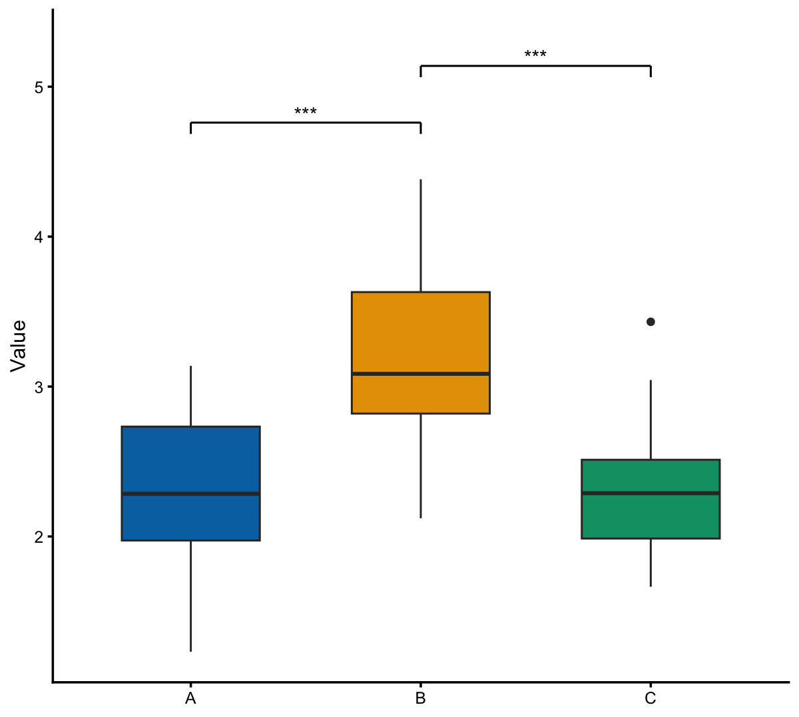

# paper-viz

论文图的可运行图库、统一风格和给 agent 用的取图说明。每张图用脚本里的模拟数据生成。

在线画廊：<https://xuzhen-li.github.io/paper-viz/>

## This is not

This is not the skills index. The index is [bioinfo-agent-skills](https://github.com/Xuzhen-Li/bioinfo-agent-skills).
The related skill name is `drawio-source-redraw`. Install that skill from this repo when the folder is present; do not copy skills out of the index.
This is not a literature sweep. That workflow is [plant-lit-review](https://github.com/Xuzhen-Li/plant-lit-review).

This repository is a figure gallery, a house style, and agent skills.

- Not an analysis pipeline
- Not a theory-mining folder
- Not a place for unpublished figure source that names private samples

## 图库目录

<!-- CATALOG:START -->

前 12 张缩略图。





| 图 | 分类 | 语言 | 何时用 |
|----|------|------|--------|
| [森林图](figures/clinical/forest) | `clinical` | R | 多个研究或亚组要并列展示效应量和区间时用。 |
| [Kaplan-Meier 生存曲线](figures/clinical/km) | `clinical` | R | 要比较两组或多组的时间-事件结局时用。 |
| [分组柱状图](figures/comparison/bar-grouped) | `comparison` | Python | 类别少、要并排比较两个或多个系列的汇总数值时用。 |
| [分组箱线图与显著性](figures/comparison/grouped-boxplot-signif) | `comparison` | R | 少数组的连续指标要看分布并标两两比较时用。 |
| [折线图](figures/correlation/line-basic) | `correlation` | Python | 自变量有顺序、要看一条轨迹的起伏时用。 |
| [火山图](figures/differential-expression/volcano) | `differential-expression` | R | 两组比较要同时看倍数变化和显著性时用。 |
| [非度量多维标度](figures/dimension-reduction/nmds) | `dimension-reduction` | R | 距离矩阵不适合线性主坐标、只要看样本远近时用。 |
| [PCA 得分散点](figures/dimension-reduction/pca-biplot) | `dimension-reduction` | Python | 已有样本的主成分坐标、要按组看分离时用。 |
| [主坐标分析](figures/dimension-reduction/pcoa) | `dimension-reduction` | R | 有样本×分类单元的丰度、要用距离看组间分离时用。 |
| [聚类表达热图](figures/heatmap/heatmap) | `heatmap` | R | 基因对样本的矩阵要同时看模块和样本顺序时用。 |
<!-- CATALOG:END -->

## 快速开始

复制一个图文件夹，换成自己的 `data.csv`（列名见该目录 `meta.yaml` 的 `data_columns`），再出图。

```bash
cp -R figures/clinical/forest ./forest
cd forest
# 编辑 data.csv
Rscript plot.R
```

Python 图同样：在该目录运行 `python3 make_data.py`（只要示例数据时）和 `python3 plot.py`。R 图导出走 `styles/r/theme_viz.R` 的 `pv_save`，同时得到 PDF、600 dpi PNG 和 1200 px 宽的 `preview.png`。

R 包装在仓库旁的项目库，说明见 [.Renviron.example](.Renviron.example)。不要把本机绝对路径写进仓库。

## 目录结构

| 路径 | 内容 |
|------|------|
| `figures/<category>/<slug>/` | `make_data`、`data.csv`、`plot`、`preview.png`、`meta.yaml` |
| `styles/` | R 与 Python 的 house style，见 [styles/style-contract.md](styles/style-contract.md) |
| `catalog/figure-types.md` | 图型说明；有实现的链到 `figures/` |
| `catalog.json` | 由 `tools/build_catalog.py` 从 meta 生成 |
| `docs/` | GitHub Pages 静态画廊（`main` 分支 `/docs`） |
| `extras/web/` | 静态嵌图与 Plotly 草稿 |
| `skills/` | `viz-router`、`schematic-design`、`drawio-source-redraw`、`paper-viz-gallery` |
| `tools/` | 目录生成与质量门 |

## 如何贡献新图

1. 新建 `figures/<category>/<slug>/`。`category` 只能是：`distribution`、`comparison`、`correlation`、`composition`、`heatmap`、`dimension-reduction`、`differential-expression`、`enrichment`、`population-genetics`、`genome`、`phylogeny`、`network`、`microbiome-ecology`、`clinical`、`schematic`。
2. `make_data.R`（或 `.py`）里 `set.seed` / 固定随机种子，写出小于 200KB 的 `data.csv`。`plot.R` 只读 `data.csv`，`source("../../../styles/r/theme_viz.R")`，用 `pv_palette` 和 `pv_save`。
3. `meta.yaml` 必填：`title`、`title_zh`、`slug`、`category`、`tags`、`packages`、`data_columns`、`when_to_use`、`customize`、`lang`（`R` 或 `Python`）。
4. 质量门：`tools/check_figure.sh figures/<category>/<slug>` 必须通过（能出 `preview.png`、源码无本机绝对路径、无来源黑名单用词）。然后 `python3 tools/build_catalog.py`。

同一图型只留一版。R 能做的以 R 为主；Python 只作为可选 `plot.py` 放在同一目录。

## Skills

四个 skill 都在本仓库 `skills/`，不要从 skills 索引仓库再拷一份。

- `paper-viz-gallery`：按标签从本图库检索、复制、换数据、导出。
- `viz-router`：先决定走数据图、示意图还是 draw.io。
- `schematic-design`：HTML/SVG 架构、流程、时序。保留其目录里的 MIT `LICENSE`（上游 diagram-design）。
- `drawio-source-redraw`：按原图坐标重绘可编辑 draw.io。

## License

代码 MIT，Copyright (c) 2026 Xuzhen Li。见 [LICENSE](LICENSE)。
