# paper-viz

科研绘图的 house style、可运行 recipes 和画图 skills。图用脚本里的模拟数据生成。

## This is not

This is not the skills index. The index is [bioinfo-agent-skills](https://github.com/Xuzhen-Li/bioinfo-agent-skills).
The related skill name is `drawio-source-redraw`. Install that skill from this repo when the folder is present; do not copy skills out of the index.
This is not a literature sweep. That workflow is [plant-lit-review](https://github.com/Xuzhen-Li/plant-lit-review).

- Not an analysis pipeline
- Not a theory-mining folder
- Not a place for unpublished figure source that names private samples

## Gallery

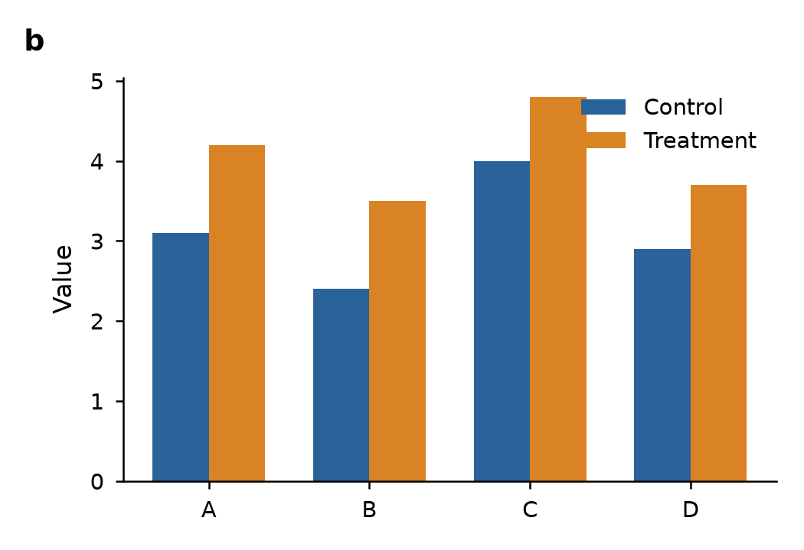
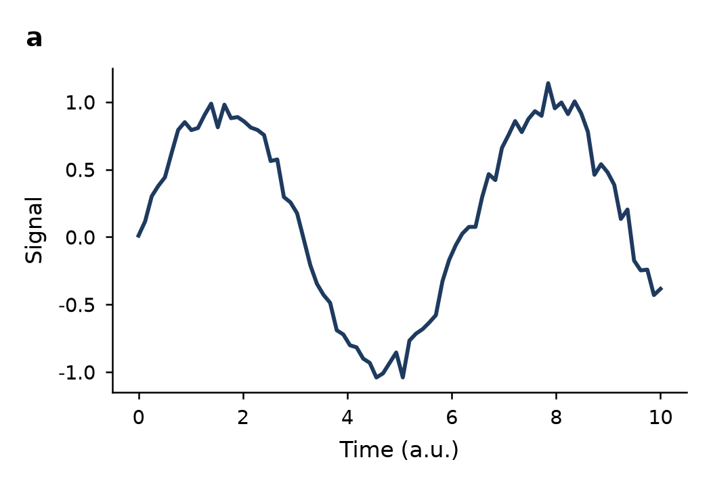
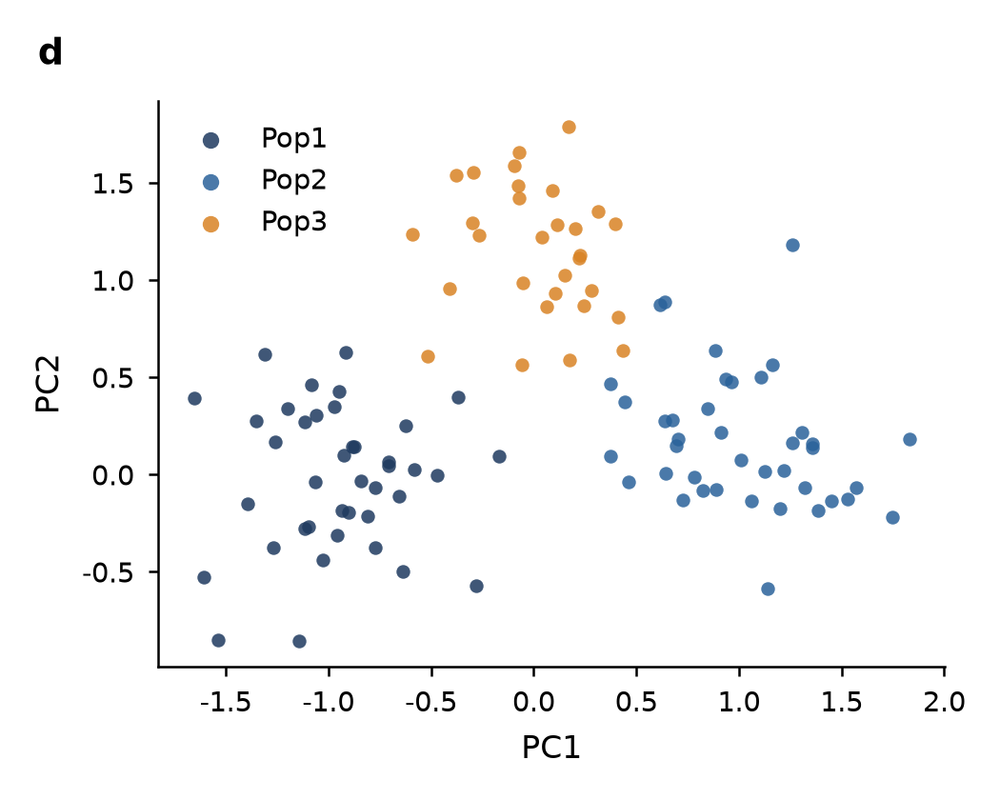
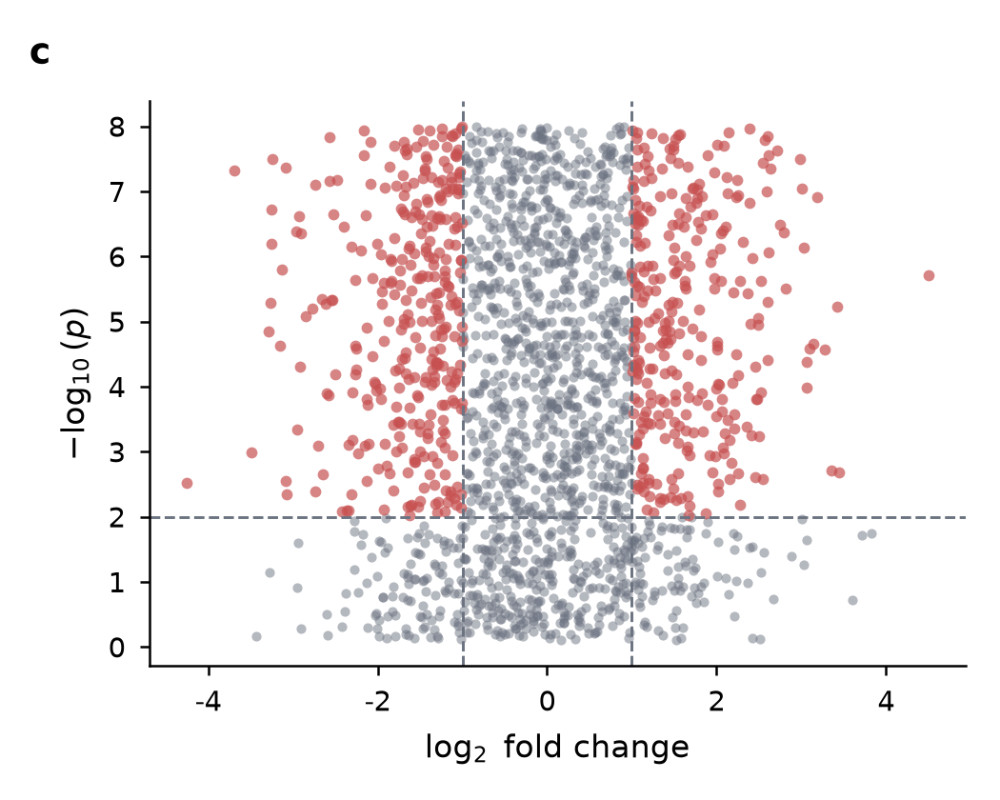
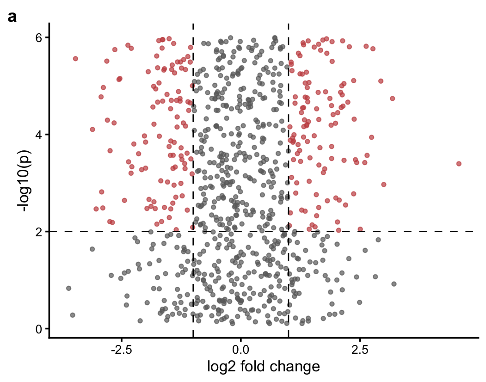
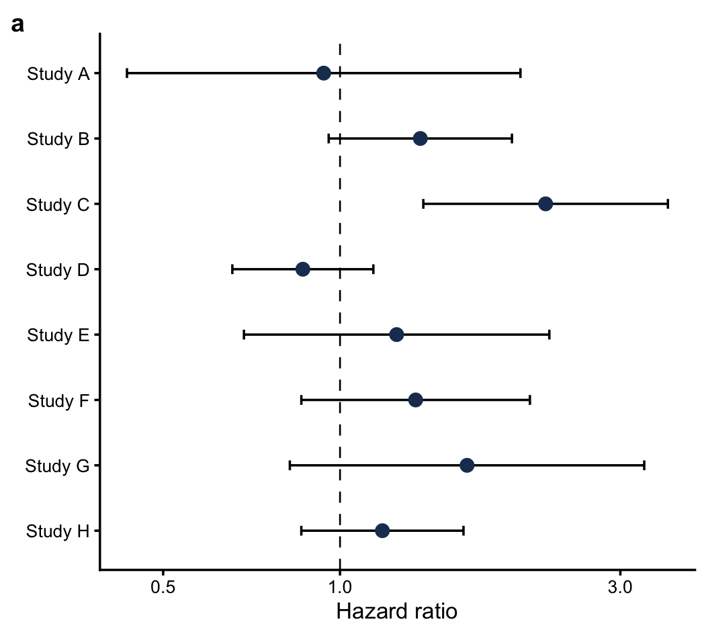
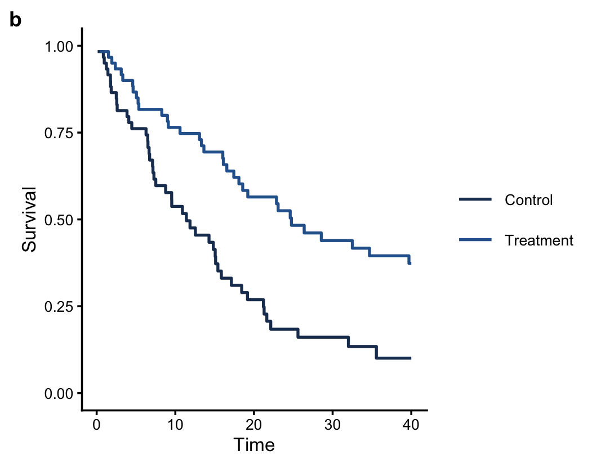
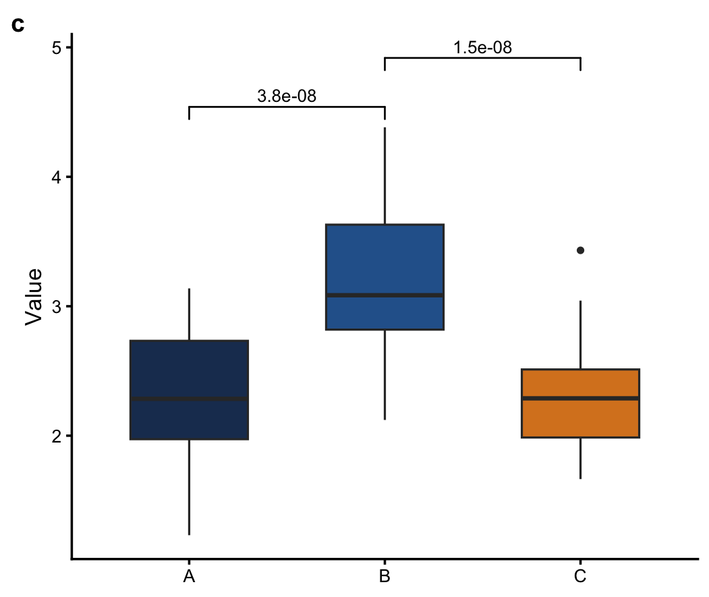
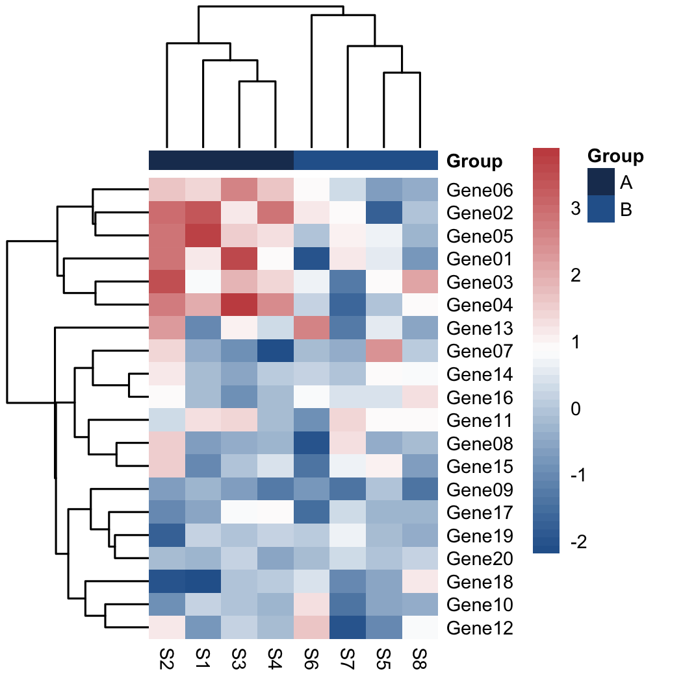
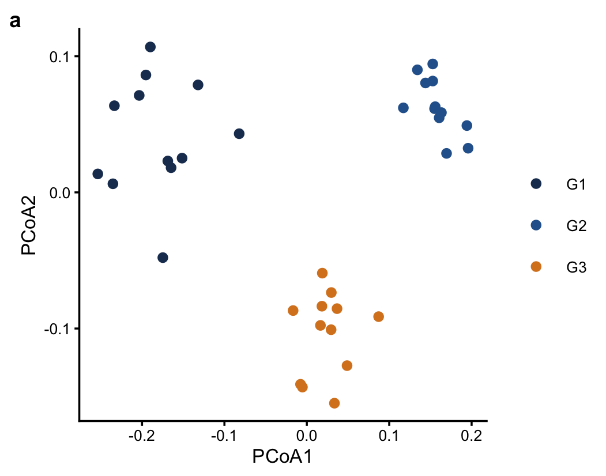
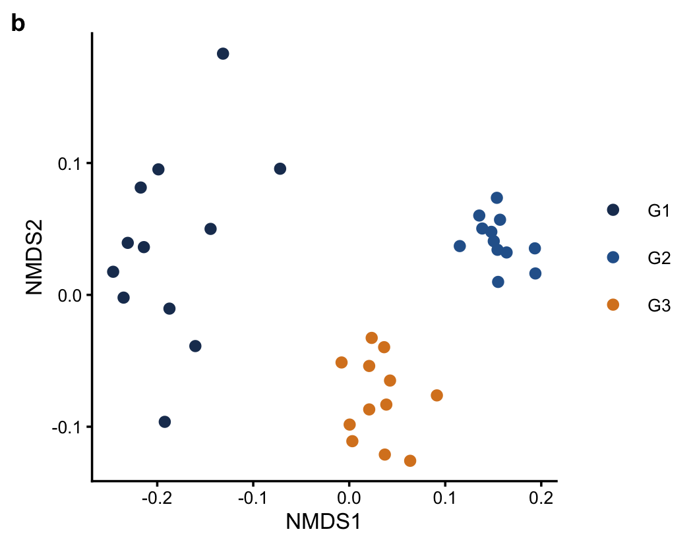

## 快速开始

Python（在仓库根目录）：

```bash
python recipes/python/volcano/plot.py
python recipes/python/bar-grouped/plot.py
python recipes/python/line-basic/plot.py
```

R（先进入 `recipes/r`，脚本用相对路径 `source`）：

```bash
cd recipes/r
Rscript volcano.R
Rscript heatmap.R
```

依赖：Python 需要 `numpy` 与 `matplotlib`。R 需要 `ggplot2`；分组箱线还要 `ggpubr`，热图要 `pheatmap`，生存曲线要 `survival`，NMDS 要 `MASS`。

## 目录

| 路径 | 内容 |
|------|------|
| `styles/python` | matplotlib 样式与 `matplotlibrc` |
| `styles/r` | ggplot2 主题 |
| `styles/style-contract.md` | 期刊终稿字号、线宽、导出 |
| `recipes/python` | 柱状、折线、PCA、火山图 |
| `recipes/r` | 火山、森林、KM、箱线、热图、PCoA/NMDS |
| `recipes/web` | 静态嵌图与 Plotly |
| `gallery` | 各 recipe 的 PNG |
| `catalog/figure-types.md` | 图型与 recipe 对照 |
| `skills/` | `viz-router`、`schematic-design`、`drawio-source-redraw` |

## Skills

三个 skill 都在本仓库 `skills/`，不要从 skills 索引仓库再拷一份。

- `viz-router`：先决定走数据图、示意图还是 draw.io。
- `schematic-design`：HTML/SVG 架构、流程、时序。保留其目录里的 MIT `LICENSE`（上游 diagram-design）。
- `drawio-source-redraw`：按原图坐标重绘可编辑 draw.io。

Cursor 里把对应目录链到技能路径，或整份复制 `skills/<name>`。`schematic-design` 的许可以该目录 `LICENSE` 为准；仓库其余代码见根目录 `LICENSE`。

## License

代码 MIT，Copyright (c) 2026 Xuzhen Li。见 [LICENSE](LICENSE)。
