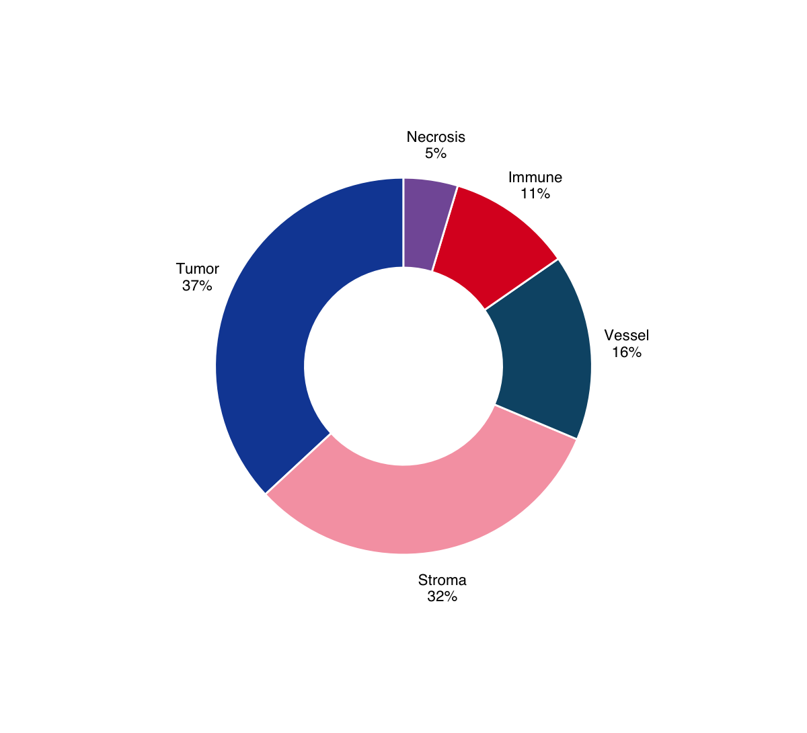
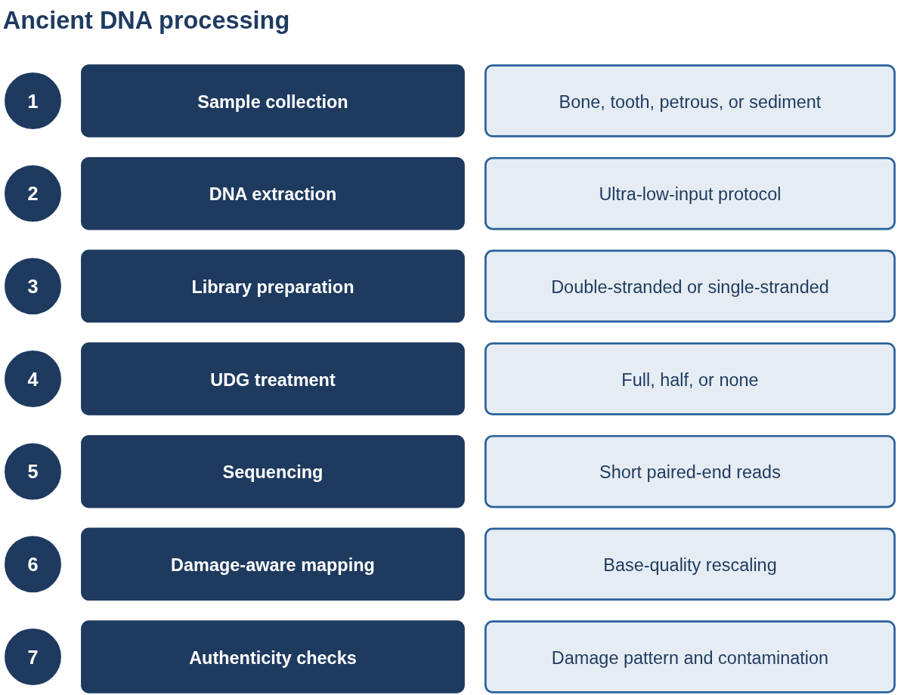
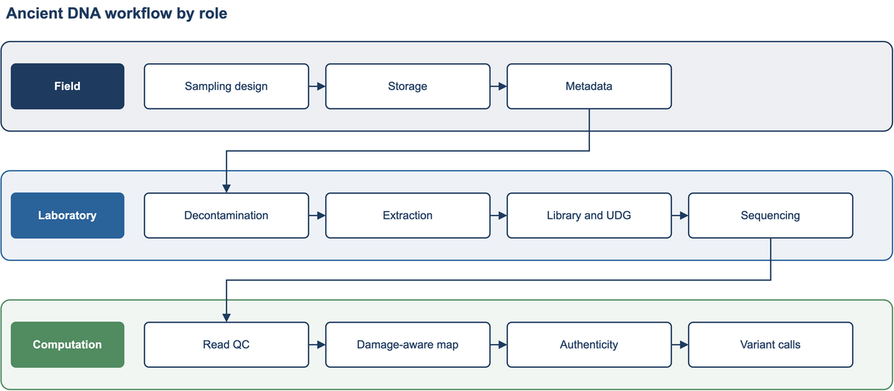
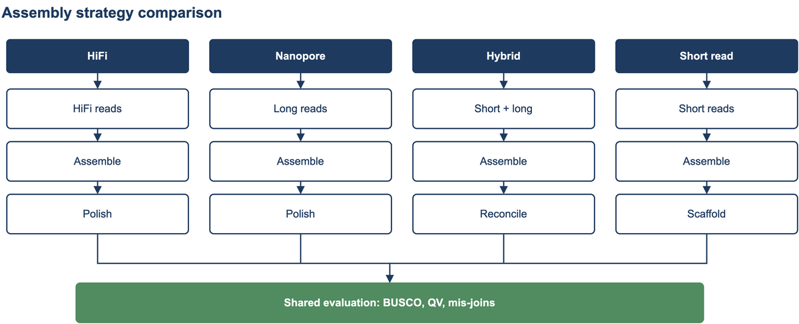
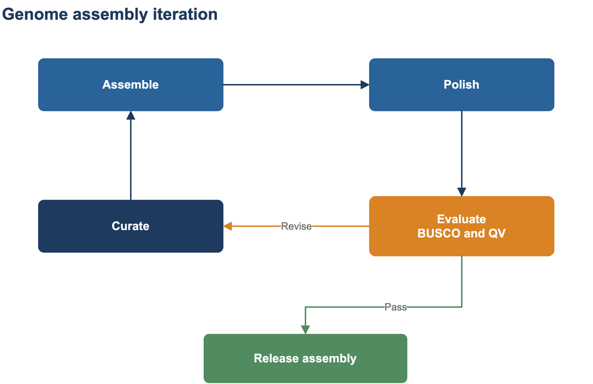

# paper-viz

[](LICENSE)
[](https://xuzhen-li.github.io/paper-viz/)
[](https://xuzhen-li.github.io/paper-viz/)


R 优先的科研绘图库：复制一张图的文件夹，按列接口换掉 `data.csv`，就能用统一期刊风格出图；也方便 agent 检索调用。

R-first paper-figure library: copy a figure folder, swap `data.csv` to the declared columns, and export in one journal style—also easy for agents to find and reuse.

在线画廊 / Gallery: <https://xuzhen-li.github.io/paper-viz/>

画廊一张卡片是一个主图。近重复图写在 `meta.yaml` 的 `variant_of` 上，变成这张卡片里的切换，不再各占一格。顶栏按任务筛选，也可以把数据图和流程图分开。搜索匹配中英文标题、标签、`when_to_use`、`customize` 和列名（例如「差异基因」会找到火山图和 MA 图）。打开卡片可以看大图、用途、列说明、CSV 表头和前 5 行、脚本顶部赋值参数和画布毫米；可以复制 `plot.R`，并下载原始的 `plot.R`、`data.csv`、`make_data.R`（流程图则是 `template.drawio` 和 `figure.svg`）。地址栏 `#slug` 直接打开该图，例如 <https://xuzhen-li.github.io/paper-viz/#volcano> 。

One gallery card is one main figure. Near-duplicates set `variant_of` in `meta.yaml` and show up as toggles on that card. Filter by task, and separate data figures from schematics. Search matches titles, tags, when-to-use text, customize notes, and column names. Open a card for the large preview, column descriptions, a CSV sample, top-of-file parameters, and canvas size; copy `plot.R` or download the raw files. `#slug` opens that figure, for example <https://xuzhen-li.github.io/paper-viz/#volcano>.

## 分类 / Categories

<!-- CATALOG:START -->

共 122 张。

| 分类 | 中文 | 数量 |
|------|------|------|
| `distribution` | 分布 | 9 |
| `comparison` | 比较 | 11 |
| `correlation` | 相关 | 8 |
| `composition` | 组成 | 12 |
| `heatmap` | 热图 | 3 |
| `dimension-reduction` | 降维 | 6 |
| `differential-expression` | 差异表达 | 3 |
| `enrichment` | 富集 | 3 |
| `population-genetics` | 群体遗传 | 14 |
| `genome` | 基因组 | 20 |
| `phylogeny` | 系统发育 | 2 |
| `network` | 网络 | 2 |
| `microbiome-ecology` | 微生物与生态 | 5 |
| `clinical` | 临床 | 3 |
| `schematic` | 流程图模板 | 20 |
| `layout` | 拼图 | 1 |

### 分布 `distribution`（9）


### 比较 `comparison`（11）


### 相关 `correlation`（8）


### 组成 `composition`（12）




### 热图 `heatmap`（3）


### 降维 `dimension-reduction`（6）


### 差异表达 `differential-expression`（3）


### 富集 `enrichment`（3）


### 群体遗传 `population-genetics`（14）


### 基因组 `genome`（20）


### 系统发育 `phylogeny`（2）


### 网络 `network`（2）


### 微生物与生态 `microbiome-ecology`（5）


### 临床 `clinical`（3）


### 流程图模板 `schematic`（20）






### 拼图 `layout`（1）


<!-- CATALOG:END -->

## 快速开始 / Quick start

复制一个图文件夹，按该目录 `meta.yaml` 的 `data_columns` 替换 `data.csv`，再出图。

Copy a figure folder, replace `data.csv` using `data_columns` in `meta.yaml`, then plot.

```bash
cp -R figures/differential-expression/volcano ./volcano
cd volcano
# 按 data_columns 编辑 data.csv
Rscript plot.R
```

R 图用 `styles/r/theme_viz.R` 的 `pv_save`，同时写出 PDF、600 dpi PNG 和 1200 px 宽的 `preview.png`。流程图模板在 `figures/schematic/`：用 draw.io 打开 `template.drawio` 直接改字，预览是 `figure.svg`。

CRAN：

```r
install.packages(c(
  "MASS", "ape", "circlize", "cowplot", "ggalluvial", "ggbeeswarm", "ggplot2",
  "ggraph", "ggrepel", "ggridges", "ggseqlogo", "ggvenn", "igraph", "maps",
  "pROC", "patchwork", "scales", "scatterpie", "survival", "vegan"
))
```

Bioconductor：

```r
if (!requireNamespace("BiocManager", quietly = TRUE)) install.packages("BiocManager")
BiocManager::install(c("ComplexHeatmap", "ggplotify", "ggtree"))
```

两张 Python 图另需 `matplotlib` 与 `numpy`。不要把本机绝对路径写进仓库。

## 给 agent 用 / For agents

用法在 [AGENTS.md](AGENTS.md)。用下面的命令检索，或读 [catalog.json](catalog.json)（`tools/build_catalog.py` 生成，不要手改）。给大模型的纯文本索引是 [docs/llms.txt](docs/llms.txt)。技能说明仍见 [skills/paper-viz-gallery/SKILL.md](skills/paper-viz-gallery/SKILL.md)。

How an AI agent should use this library is in [AGENTS.md](AGENTS.md). Search with the commands below, or read [catalog.json](catalog.json) (generated by `tools/build_catalog.py`; do not edit it by hand). The plain-text index is [docs/llms.txt](docs/llms.txt). The skill note is [skills/paper-viz-gallery/SKILL.md](skills/paper-viz-gallery/SKILL.md).

```bash
python3 tools/find_figure.py volcano
python3 tools/find_figure.py 差异基因
python3 tools/find_figure.py --category population-genetics
python3 tools/find_figure.py --column pvalue
python3 tools/find_figure.py --slug volcano --json
```

## 目录 / Layout

| 路径 | 内容 |
|------|------|
| `figures/<category>/<slug>/` | R 图：`make_data.R`、`data.csv`、`plot.R`、`preview.png`、`meta.yaml`；流程图：`template.drawio`、`figure.svg`、`preview.png`、`meta.yaml` |
| `styles/` | 期刊风格，见 [styles/style-contract.md](styles/style-contract.md) |
| `catalog.json` | 全库索引 |
| `AGENTS.md` | AI agent 怎么检索、换数据、出图 |
| `docs/llms.txt` | 给大模型的一行一条主图索引 |
| `docs/` | GitHub Pages 画廊（`main` 分支 `/docs`） |
| `extras/web/` | 静态嵌图与 Plotly 草稿 |
| `skills/paper-viz-gallery/` | agent 取图说明 |
| `tools/` | 目录生成与质量门 |

## 贡献 / Contributing

1. 新建 `figures/<category>/<slug>/`。`category` 只能是：`distribution`、`comparison`、`correlation`、`composition`、`heatmap`、`dimension-reduction`、`differential-expression`、`enrichment`、`population-genetics`、`genome`、`phylogeny`、`network`、`microbiome-ecology`、`clinical`、`schematic`、`layout`。
2. R 图：`make_data.R` 固定随机种子，写出小于 200KB 的 `data.csv`。`plot.R` 只读数据，`source("../../../styles/r/theme_viz.R")`，用 `theme_viz()`、`pv_palette()` 和 `pv_save()`。流程图：自写 `template.drawio` + `figure.svg` + `preview.png`，`lang: drawio`。
3. `meta.yaml` 必填：`title`、`title_zh`、`slug`、`category`、`tags`（英文）、`packages`、`data_columns`、`when_to_use`、`customize`、`lang`（`R`、`Python` 或 `drawio`）。`title_zh`、`when_to_use`、`customize` 不能为空。
4. 质量门：`bash tools/check_figure.sh figures/<category>/<slug>` 必须通过，然后 `python3 tools/build_catalog.py`。

同一图型只留一版。变体写进 `plot.R` 顶部参数，并记在 `customize`。

## License

MIT. Copyright (c) 2026 Xuzhen Li. See [LICENSE](LICENSE).
